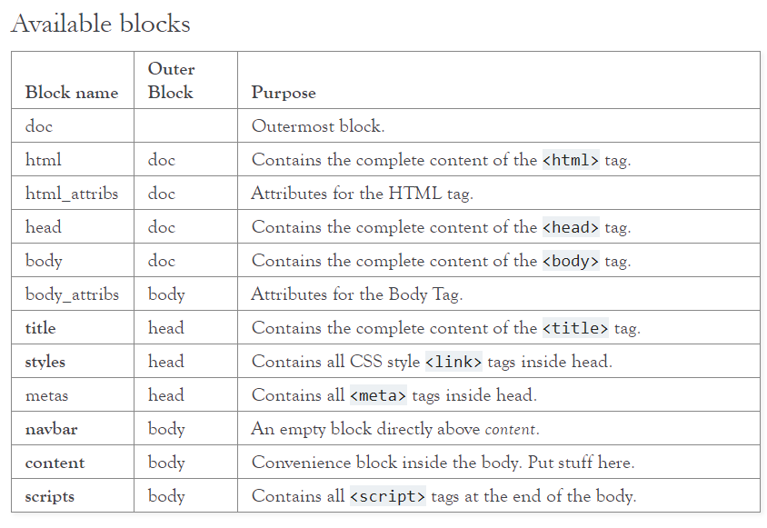

# Python - Flask <!-- omit in toc -->

<div align="center">
  
  <small><p>Flask Logo</p></small>
</div>

- [Fundamentos](#fundamentos)
  - [Aplicaciones web](#aplicaciones-web)
    - [Ventajas](#ventajas)
  - [¿Qué es Flask?](#%c2%bfqu%c3%a9-es-flask)
  - [Request y Response](#request-y-response)
- [Templates](#templates)
  - [Hot reload](#hot-reload)
- [Extensiones](#extensiones)
  - [Flask-Bootstrap](#flask-bootstrap)
  - [Desarrollo](#desarrollo)

# Fundamentos

## Aplicaciones web
Flask permite procesar un aplicación web en una red de servidores. Estos servidores unen su poder de procesamiento con el fin de transmitir solicitudes a todo el mundo.

El servidor procesa la información obtenida por el navegador, luego realiza procedimientos de acuerdo a la lógica de negocio para que está sea enviada de regreso al cliente que la solicito.

### Ventajas
* Muchas de las aplicaciones web que existen son gratuitas
* Puedes acceder a tu información en cualquier momento y lugar
* No dependes de un dispositivo específico ya que la aplicación se encuentra almacenada en la web

## ¿Qué es Flask?
Es un microframework, su estructura fundamental es simple y personalizable
* No tiene un sistema de autenticación o base de datos específica
* Se puede extender con los flask extensions
* Flask sirve para hacer una cosa de forma simple
* Templete engine JinJa2
* Flask no tiene una arquitectura
* Flask no tiene un ORM

## Request y Response
El browser hace un petición y el servidor envia una respuesta

```python
from flask import Flask, request, make_response, redirect
app = Flask(__name__)

@app.route('/')
def index():
    user_ip = request.remote_addr
    response = make_response(redirect('/hello'))
    response.set_cookie('user_ip', user_ip)
    return response

@app.route('/hello')
def hello():
    user_ip = request.cookies.get('user_ip')
    return f'Hello World Flask {user_ip}'
```

# Templates
JinJa 2
https://jinja.palletsprojects.com/en/2.11.x/

Expandir un diccionario con **variables

## Hot reload

Para aplicar los cambios sin que afecte el cache teclear en Chrome:
> CTRL + SHIFT + R

# Extensiones

## Flask-Bootstrap

<div align="center">
  
  <small><p>Bootstrap</p></small>
</div>

## Desarrollo

**Blueprints:** Son una serie de rutas que podemos integrar en nuestra aplicación, pero desde otro directorio, es decir, permite modular la aplicación en pequeñas aplicaciones que hagan cosas específicas, como autenticación o el welcome.
* Se crea un blueprint para tareas específicas y es más fácil de manejar 