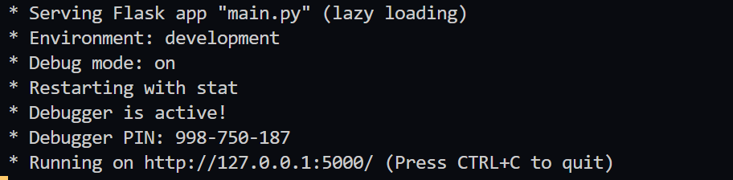
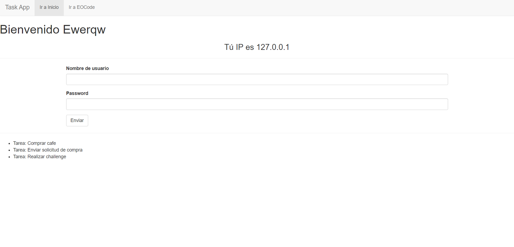

# Task-with-Python-Flask

## How to run

Inside **flask-app folder**

Create a virtual enviroment
`python -m venv env`

Python and Flask
`pip install -r requirements.txt`

Verify
`pip freeze`

On Linux
> Create variable
> `export FLASK_APP=main.py`
>
> Verify variable
> `echo $FLASK_APP`

On Windows
> Create a varible
> `set FLASK_APP=main.py`

Run development server
`flask run` or `python -m flask run`

Enable debug if needs
> `export FLASK_DEBUG=1`

  
  <small>
Run App
</small>

## Preview

  
  <small>
Task App
</small>

