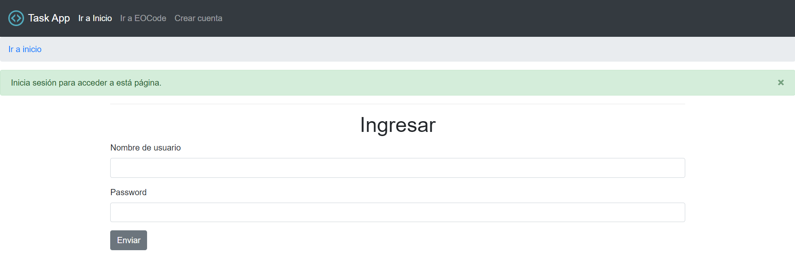
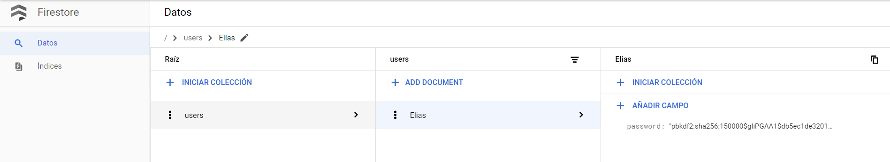

# :coffee:Task-with-Python-Flask

## Python - Flask - Docs
See info what do you need for this project
* [Ver documentación](Docs/README.md)

## How to run project

Inside **flask-app folder**

Create a virtual enviroment
`python -m venv env`

Python and Flask
`pip install -r requirements.txt`

Verify
`pip freeze`

On Linux
> Create variable
> `export FLASK_APP=main.py`
>
> Verify variable
> `echo $FLASK_APP`

On Windows
> Create a varible
> `set FLASK_APP=main.py`

Run development server
`flask run` or `python -m flask run`

Enable debug if needs
> `export FLASK_DEBUG=1`

  
  <small>
Run App
</small>

## Preview

  
  <small>
Task App
</small>

## Deploy and Connect to GCloud DataStore
### Requirements

* Install Google Cloud SDK https://cloud.google.com/sdk/docs/quickstarts
* Create a Project
* Active FireStore mode DataStore

Next execute next command:

`gcloud init`
`gcloud auth login`
`gcloud config set project PROJECT_ID`
`gcloud auth application-default login`

#### FireStore

  
  <small>
FireStore Capture
</small>

